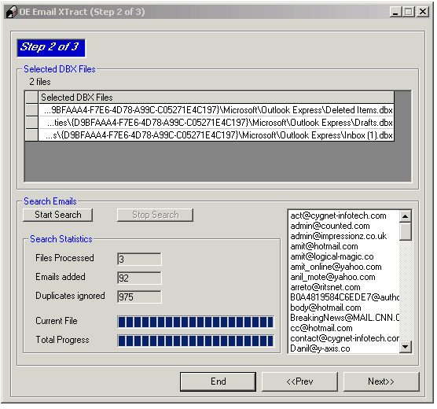



## OE Email Extractor

### Description

Email Xtractor extracts email ids from Outlook Express DBX files and enables them to be exported to other applications.
 
### More Info
 

             |
---                |---
**Submitted On**   |2004-03-09 17:31:10
**By**             |[amit sengupta](https://github.com/Planet-Source-Code/PSCIndex/blob/master/ByAuthor/amit-sengupta.md)
**Level**          |Advanced
**User Rating**    |4.2 (21 globes from 5 users)
**Compatibility**  |VB 6\.0
**Category**       |[Complete Applications](https://github.com/Planet-Source-Code/PSCIndex/blob/master/ByCategory/complete-applications__1-27.md)
**World**          |[Visual Basic](https://github.com/Planet-Source-Code/PSCIndex/blob/master/ByWorld/visual-basic.md)
**Archive File**   |[OE\_Email\_E1721843192004\.zip](https://github.com/Planet-Source-Code/amit-sengupta-oe-email-extractor__1-52477/archive/master.zip)

